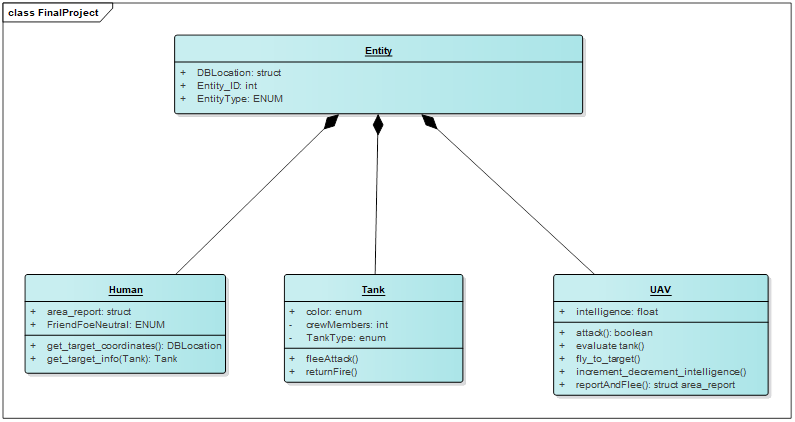
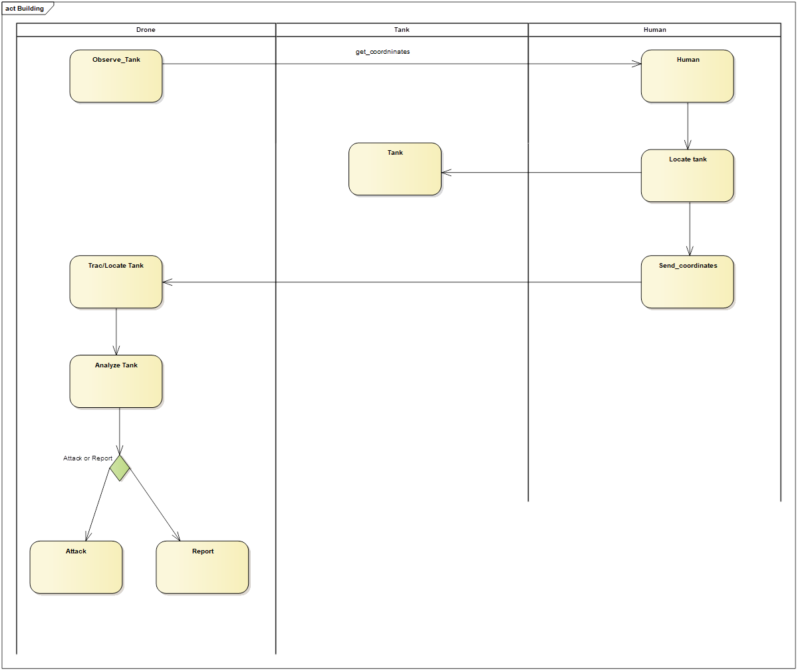

# IDS6145(SimTech 2019) - Research Plan 

* Group Name: (R)omeo (O)scar (B)eta (O)scar (T)ango (S)ierra (ROBOTS)
* Group participants names: Justin Loveless, Blake Nguyen, and Ugur Uysal
* Project Title: Trust and Reliance in Military Automation
(Abstract here - basically your pitch with some modification - but short overview)
(TEASER IMAGE HERE - should wow me to read your work)

* [Google Doc](https://docs.google.com/document/d/1mcqMaQYsubLfIDFFgeauV-vMFGffujcG4K2Izi4j_rk/edit)

## 1. General Introduction

(States your motivation clearly: why is it important / interesting to solve this problem?)
(Add real-world examples, if any)
(Put the problem into a historical context, from what does it originate? Are there already some proposed solutions?)

**Blake’s Motivation:** My research interests and experience are in human-robot interaction (HRI), specifically, situation awareness (SA), trust and reliability, and usability related to automation technology. Most of my work contributes to the Robotics Collaborative Technology Alliance (RCTA) program, which the Army Research LAB (ARL) at UCF/IST are also involved with. As a result, my research experience are focused on automation technology, specifically, what is the relationship between humans and robots and how can we improve the communication interactions seen in human-robot teams. Previous research regarding trust and reliance in human-robot teams suggest that when reliability falls below 70% reliability, automation is considered not useful, and will harm overall task performance. However, if the human teammate cannot perform a task unaided, or if the environment/situation is too risky for a human to begin with, there may still be an advantage or willingness to trust or rely on automation even if automation falls below the threshold (Maltz & Shinar, 2003). In the military domain, there is an increasing number of humans who are or will be performing tasks with the help of automation (Parasuraman & Wickens, 2008). In real world applications, information acquisition and analysis are rarely perfect, whether performed by humans or automation (St. John & Manes, 2002). Even when automation is imperfect, in most scenarios automation improves system performance (Yeh, Merlo, Wickens, & Brandenburg, 2003). Previous research states that when automation reliability levels fall below 70% (e.g., Madhavan, Wiegamann, & Lacson, 2006), performance tends to decrease levels lower than those of manual task performance alone (i.e., without assistance from automation). Wickens and Dixon (2007) identified the 70% reliability threshold, which is based on a review of studies in which the automation performed tasks which human could also perform unaided. In these types of scenarios, if reliability falls too low, automation may be perceived as useless, or even as being detrimental to overall task performance. As a result, making the human operators less likely to rely on automated systems, and instead, tasks will be executed manually without assistance from automation. 

**Justin’s Motivation:** I am motivated to observe the cost effectiveness and efficiency of drones when deployed in air combat scenarios. When the cost of some of the latest Department of Defense (DoD) combat aircraft is soaring upwards of 100 Million dollars, finding alternate means of air defense is an area of focus to be considered moving forward. I am interested in analyzing performance of one F-35 stealth fighter in a combat situation, vs 10 combat drones in the same scenario. I would like to answer the questions, “Which approach is more economical?”, and  “Which approach will be more effective in reaching the objective?”. 

**Ugur’s Motivation:** Armed forces use technology to gain superiority on the battlefield. Recent breakthroughs in the field of Artificial Intelligence and Unmanned Systems provide new uses for military operations. In my the research project HUMAN-ASSISTED WEAPON SYSTEMS I compared the semi-autonomous operation with the supervised-autonomous operation of drones. I think that on the battlefield of the future, those who use fully autonomous systems will be successful. In this project, I would like to improve the effectiveness of drones by implementing AI techniques such as Reinforcement Learning to operate those fully autonomous.

(You should begin by introducing your topic. In this section, you should define the core terminology specific to the field, introduce the problem statement, and make clear the benefits (motivate!) of resolving that problem statement. The main difference between the ABSTRACT and Introduction sections is that the abstract summarizes the entire project, including results, whereas the introduc-tion only provides the motivation of the problem and an overview of the proposed solution.)

**Problem Statement:**
**Close air support missions of a manned aircraft against enemy armored air defense can be risky for human pilots:**

##### Click on the image to watch the video **ArmA 3: Risky CAS mission with F181** on YouTube.

**Proposed Solution:** 
The use of drones could help to reduce the risk without compromising reliability. The control of drones can be done at different levels of autonomy: 
- Semi-autonomous (Human-IN-the-loop) 
- Supervised-autonomous (Human-ON-the-loop) 
- Fully- autonomous (Human-OUT-of-the-loop) 

In the project [HUMAN-ASSISTED WEAPON SYSTEMS](https://github.com/UgurUysal86/project_template) we compared the **semi-autonomous operation** with the **supervised-autonomous operation** of drones.

* An example of a Semi-autonomous UCAV operation in a "Multi-Drone Control" scenario can be seen here: https://www.youtube.com/watch?v=4Squmz5BZv0
* An example of a Supervised-autonomous UCAV operation in a "Multi-Drone Control" scenario can be seen here: https://www.youtube.com/watch?v=YDD9rnlW4kY

**In this project we now want to analyze a Fully-autonomous UCAV operation in a "Multi-Drone Control" scenario.**

**This project makes the following contributions:**
- We believe our project will contribute to advancing the study of human-robot interaction (HRI).
- We believe our project will contribute to the area of research on trust and reliability in automation technology.
- We believe the implementation of stimulated autonomous air fighters in ArmA 3 will provide insight on the real world application of autonomous drones. 

## 2. The Model

(Provide structural and behavior diagrams of the system you wish to study.) (Why is your model a good abtraction of the problem you want to study?) (Are you capturing all the relevant aspects of the problem?) (Use the model to tell us what is going on.)
The model consists of a Drone, Tank, and Human, which all inherit certain shared traits from the class Entity. 

The Drone gets its target/mission data from the human, who holds the information such as location of target, number of targets in area, and other threats in the area. The human sends the data to the Drone, which then locates the target, analyzes the activity, and either attacks or reports its observation.

(explicitly list your requirements of what the model will have and simulate for the proposal)
The drones will attack enemy tanks as directed
The drones will provide updated information on a target once observed

## Fundamental Questions
(At the end of the project you want to find the answer to these questions) (Formulate a few, clear questions. Articulate them in sub-questions, from the more general to the more specific.)

1. What is the relationship between humans and robots?
2. Which condition (i.e., human-in-the-loop, human-on-the-loop, human-out-of-the-loop generates higher reliability? 
3. Based on the reliability results, do the results have an impact on trust?

## 3. Expected Results
(What are the answers to the above questions that you expect to find before starting your research?) (This changes from Expected (Proposal) to just Results (final report)) (you should verbally define them) (sketch a few graphs of what you are roughly going for - not the data but histogram of this, line graph of that, screenshot of an agent - use paper and pencil sketches)

## 4. Research Methods

In the research project [HUMAN-ASSISTED WEAPON SYSTEMS](https://github.com/UgurUysal86/project_template) we compared the **semi-autonomous operation** with the **supervised-autonomous operation** of drones.
Now, we want to compare the results obtained during that project with results of the **fully-autonomous operation** of drones.
Therefore we are using the same experimental setup: 
* Quantitative Method Approach as defined by Creswell & Creswell (2017)
* collecting, analyzing, and interpreting quantitative data through simulation experiments using the virtual simulation software ArmA 3.

### 4.1 Hypothesis
Unmanned Systems can be operated fully-autonomously (human-out-of-the-loop) with the same reliability as operated supervised-autonomously (human-on-the-loop) in a virtual military scenario.

### 4.2 Setup of the experimental Study Method Plan
#### 4.2.1 Participants
Our group will use the scenario "Multi-Drone control" from [HUMAN-ASSISTED WEAPON SYSTEMS](https://github.com/UgurUysal86/project_template) to compare the **semi-autonomous operation** with the **supervised-autonomous operation** of drones to determine the reliability of the autonomous agents.

#### 4.2.2 Independent variables:
* Level of autonomy  {supervised autonomous, fully autonomous},
* Amount of targets {6} 
* Amount of UCAV (Unmanned Combat Aerial Vehicle ) {4}
* Available Munitions {12 AGM} 
* Amount of unbound vehicles {8}
* Complexity of Scenario {middle}

#### 4.2.3 Dependent variables (Responses):
* Amount of destroyed targets {0..6} 
* Amount of UCAV at the end of the mission {0..4} 
* Elapsed Time since command received (sec) {0..inf} 
* Amount of used Ammunition {0..12} 
* Only hostile targets engaged {True = 1, False = 0}
* Operator was able to  supervise all used autonomous systems {True = 1, False = 0}
* Operator perception of  cognitive workload  {1..10}

### 4.3 Instrumentation and Materials
Since the full potential of autonomous systems can only be estimated today due to technologies that are not yet fully developed, we want to use a simulation environment in which these technologies are already available. Therefore we use virtual simulation instead of robotics for our experiments. The military tactical shooter video game [ArmA 3](https://arma3.com/) Version 1.9 including ["Apex"](https://arma3.com/apex), ["Jets"](https://arma3.com/dlc/jets), and ["Tanks"](https://arma3.com/dlc/tanks), are used as our framework to create a military scenario for generating data to answer the quantitative research questions.

### 4.4 Experimental Procedures:
#### 4.4.1 Scenario "Multi-Drone control" with 4 [UCAVs](http://armedassault.wikia.com/wiki/UCAV_Sentinel) and 6 Targets (3 [AA-Tanks](http://armedassault.wikia.com/wiki/ZSU-39_Tigris), 1 [APC](http://armedassault.wikia.com/wiki/BTR-K_Kamysh), 2 [Main Battle Tanks (MBTs)](http://armedassault.wikia.com/wiki/T-140K_Angara)) from [HUMAN-ASSISTED WEAPON SYSTEMS](https://github.com/UgurUysal86/project_template).

[The ArmA 3 mission file can be downloaded here](https://github.com/UgurUysal86/finalProjectTemplate/tree/master/code/Fully%2520autonomous%253a4xUCAV%2C6xTargets(3AA%2C1APC%2C2Tanks).Altis). Copy and paste the scenario folder to the ArmA 3 user mission folder C:\Users\YOURNAME\Documents\Arma 3\missions to be able to load the scenario.

#### 4.4.2. Conducting the simulation experiment (30 runs) 
Running the simulation in ArmA 3: The human user assigns multiple-drones a specific area to **SEEK AND DESTROY** enemy vehicles which are then engaged fully-autonomously. The use of the drone-swarm is terminated when the predefined mission time expires. Once the drones are deployed, there is no way to cancel the mission in a Fully-autonomous operation because the human is "out-of-the-loop".
At the end of each Simulation run, the values of the response variables are saved in a excel file. 

##### Click on the image to watch the video **Fully-autonomous UCAV operation in a "Multi-Drone Control" scenario** on YouTube.

[The results of the experiment can be downloaded here.](https://github.com/UgurUysal86/finalProjectTemplate/blob/master/data/Experimentation%20Results_4%20UCAV%2C6%20Targets(3AA%2C1APC%2C2Tanks).xlsx)

#### 4.4.3 Analyzing the Results.

* Ho: There is no sufficient evidence for a difference in reliability.
* Ha: There is a sufficient evidence for a difference in reliability.

After generating the data during the simulation experiment, a statistical hypothesis test using the software "R" was conducted. The data of the supervised-autonomous operation was obtained from [HUMAN-ASSISTED WEAPON SYSTEMS](https://github.com/UgurUysal86/project_template).

* Comparing Amount of destroyed targets: 				 				**no significant difference**
* Comparing Amount of autonomous Systems at the end of the mission:		**no significant difference**
* Comparing elapsed Time since command received: 						**significant difference**
* Comparing Amount of Used Ammunition: 					 				**significant difference**
* Comparing Only hostile targets engaged: 				 				**no significant difference**
* Comparing Operator was able to supervise all used autonomous systems: **no significant difference**
* Comparing Operator perception of cognitive workload: 			 		**significant difference**

[The R-Script to analyse the Results of the Experiment can be downloaded here](https://github.com/UgurUysal86/finalProjectTemplate/blob/master/data/Analysis%20Results_4%20UCAV%2C6%20Targets(3AA%2C1APC%2C2Tanks).R)

Answer:  ...

## (Other)
(change the title and amount of headers as needed) (mention datasets you are going to use) (mention base code or examples you)

## 5. Discussion
(final only - remove whole section for proposal Readme) (What would you have done differently) (What are the contributions summerize)(what is the big take away)(what did you learn)

## 6. Future Work
(final only - remove whole section for proposal Readme) (if you had 6 more months what would be the next steps in this project.) (What are a few questions you have now)

If given six more months to work on our final project, we would like to focus our future efforts toward implementing our work into Unreal engine/Unity. If we were to implement our work into Unreal engine we would be able to further investigate and validate the results we found in ArmA 3. Implementing our work into Unreal engine/Unity would provide us with the means to compare our results to determine if our results are generalizable, significant, or even worth further exploring in future works.

Furthermore, we would like to try and improve our study design by incorporating human-subjects into our study to potentially investigate whether or not humans would or would not trust and rely on unmanned aerial drones. It would also be interesting to look at the preferences between the specific level of automation that is preferred for unmanned aerial drones. For example, depending on the level of expertise, that can also affect the level of trust and reliability in automation. A person will background experience with automation may view higher levels of automation to be trustworthy and reliable versus a novice user that may not have experience with automation. Thus, from a novice perspective, they may view lower levels of automation, therefore, believe automation is not trustworthy or unreliable. 

## References
(Add the bibliographic references you intend to use)  (Code / Projects / blogs / websites / papers...)

* [Creswell, J. W., & Creswell, J. D. (2017). Research design: Qualitative, quantitative, and mixed methods approaches. Sage publications.](https://us.sagepub.com/en-us/nam/research-design/book255675)
* Madhavan, P., Wiegmann, D. A., & Lacson, F. C. (2006). Automation failures on tasks easily performed by operators undermine trust in automated aids. Human Factors, 48(2), 241-256.
* Maltz, M., & Shinar, D. (2003). New alternative methods of analyzing human behavior in cued target acquisition. Human Factors, 45(2), 281-295.
* Parasuraman, R., & Wickens, C.D. (2008). Humans: Still vital after all these years of automation. Human Factors, 50(3), 511-520.
* St. John, M., & Manes, D. I. (2002). Making unreliable automation useful. Proceedings of the Human Factors and Ergonomics Society Annual Meeting, 46, 332-336.
* Wickens, C. D., & Dixon, S. R. (2007). The benefits of imperfect diagnostic automation: A synthesis of the literature. Theoretical Issues in Ergonomics Science, 8(3), 201-212.
* Yeh, M., Merlo, J. L., Wickens, C. D., & Brandenburg, D. L. (2003). Head up versus head down: The costs of imprecision, unreliability, and visual clutter on cue effectiveness for display signaling. Human Factors, 45(3), 390-407.

